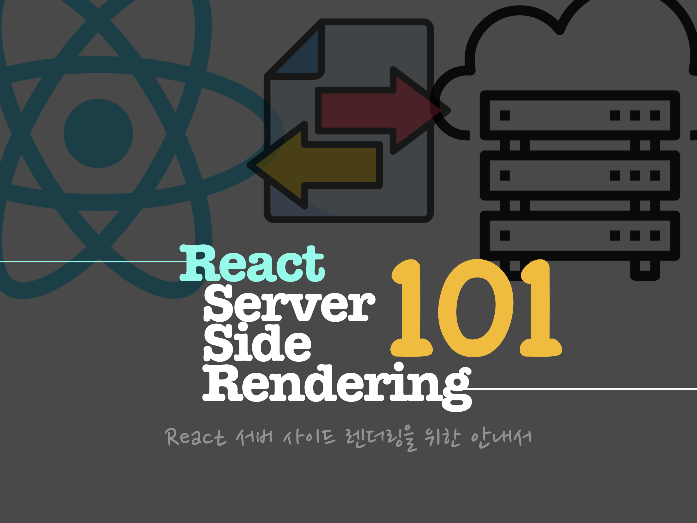

  

## 📝 Table of Contents

**First, Check the branch!**
(Following lists are linked each branch)
이 Repository의 branch를 확인해주세요. branch에 따라 **Tutorial Step**이 나누어져 있습니다.
다음 리스트는 **branch에 링크** 되어있습니다.
### [0. Project Base](https://github.com/SoYoung210/react-ssr-code-splitting/tree/master) 
이 프로젝트의 기본 셋팅입니다. 이 튜토리얼의 기술 스택은 다음과 같습니다.

* react(TypeScript)
* redux
* redux-observable

`/org` 와 `/user` 두 개의 페이지로 구성되어 있으며, 각 페이지에서 fetch action을 통해 컨텐츠를 그리고 있습니다. 
### [1. Code splitting](https://github.com/SoYoung210/react-ssr-code-splitting/tree/1-code-splitting) 
loadable/component를 통해 Route를 기준으로 Code Splitting만 진행하였습니다. 
### [2. ServerSideRendering](https://github.com/SoYoung210/react-ssr-code-splitting/tree/2-ssr)
기본적인 Server Side Rendering(이하 SSR)을 구현합니다. 
`/org` 페이지에서 header영역을 분리하여, 이 부분이 server에서 렌더링 완료된 채로 전달됩니다. 
### [3. ServerSideRendering - fetch](https://github.com/SoYoung210/react-ssr-code-splitting/tree/3-ssr-fetch)
server에서 action dispatch를 통해 `/org` 페이지에 필요한 초기 state를 구성합니다. 이 state를 통해 해당 페이지의 컨텐츠를 모두 렌더링 한 html을 client에게 전달합니다. server에서 초기 state를 구성했기 때문에 client에서 동기화 하는 로직이 있습니다.  

## 🚀 Contribution

총 3단계로 구현하며 만났던 문제에 대한 해결은 모두 [Issues](https://github.com/SoYoung210/react-ssr-code-splitting/issues) 에 기록해 두었습니다.

> Label은 해당 단계에서 발생했던 이슈임을 나타냅니다. 

이 tutorial을 따라하시다가 문제가 발생했거나, 질문이 있으신 경우 issue에 남겨주시면 감사하겠습니다. 

### And,

Special Thanks to [Jbee](https://github.com/JaeYeopHan/) 🎉
